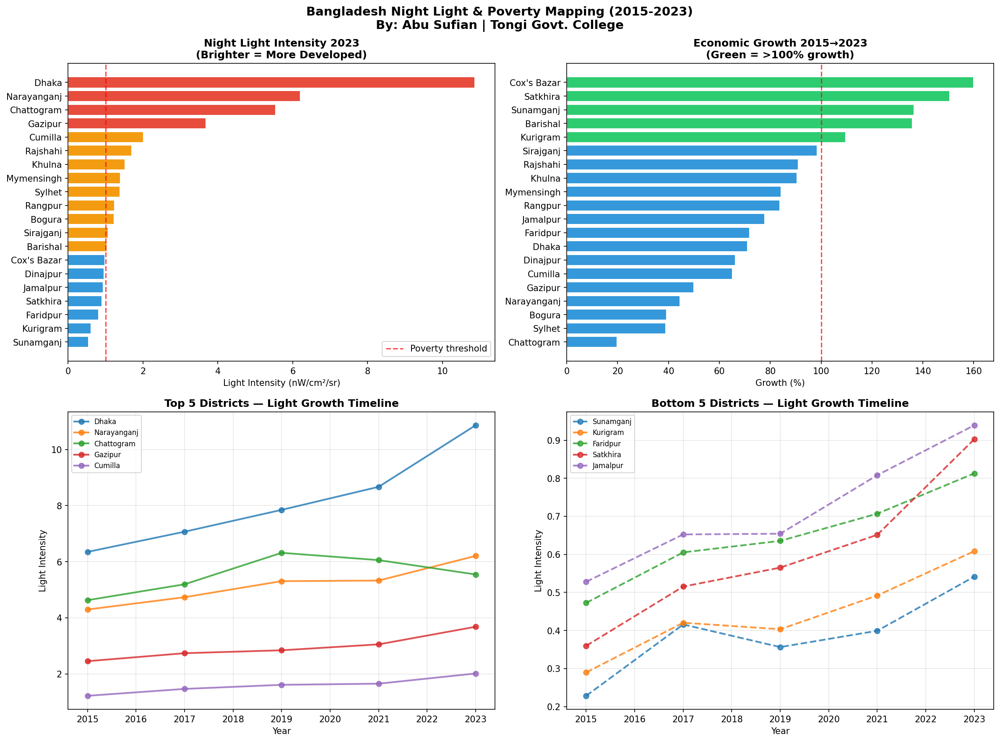

# 🌙 Bangladesh Night Light & Poverty Mapping


## 📌 Overview

This project uses NASA/NOAA VIIRS satellite night light data
to map economic development and poverty across Bangladesh districts
from 2015 to 2023.

**Core Insight:** Brighter night lights = more electricity = 
more development. Darker areas = poverty and inequality.

---

## 🔬 Key Research Findings

| Finding | Value |
|---|---|
| Most Developed District | Dhaka (10.86 nW/cm²/sr) |
| Least Developed District | Sunamganj (0.54 nW/cm²/sr) |
| Development Gap | **20x difference!** |
| Fastest Growing District | Cox's Bazar (+159.8%) |
| Districts Below Poverty Threshold | 9 out of 20 analyzed |

### 🏙️ Development Ranking 2023
| Rank | District | Light Intensity | Status |
|---|---|---|---|
| 1 | Dhaka | 10.86 | Highly Developed |
| 2 | Narayanganj | 6.21 | Developed |
| 3 | Chattogram | 5.55 | Developed |
| 4 | Gazipur | 3.68 | Developing |
| ... | ... | ... | ... |
| 20 | Sunamganj | 0.54 | Underdeveloped |

### 📈 Fastest Growing Districts (2015→2023)
| District | Growth | Reason |
|---|---|---|
| Cox's Bazar | +159.8% | International investment post-Rohingya crisis |
| Satkhira | +150.5% | Coastal development |
| Sunamganj | +136.5% | Rural electrification |
| Barishal | +135.8% | Infrastructure development |

---

## 🗺️ Visualization



---

## 🔬 Methodology

### Data Source
- **NOAA/VIIRS DNB** — Monthly night light radiance (2014-present)
- **Spatial resolution:** 500m
- **Coverage:** 20 major Bangladesh districts

### Technical Pipeline
1. VIIRS night light data extraction via Google Earth Engine
2. 15km buffer around each district center
3. Mean radiance calculation per district per year
4. Economic growth rate calculation (2015→2023)
5. Poverty threshold classification (<1.0 nW/cm²/sr)

### Why Night Lights?
Night light intensity is a globally recognized proxy for:
- Electricity access
- Economic activity
- Urban development
- Poverty levels

---

## 🛠️ Tools & Technologies

| Tool | Purpose |
|---|---|
| Google Earth Engine | VIIRS satellite data |
| NOAA/VIIRS DNB | Night light imagery |
| Python 3.12 | Data processing |
| pandas + numpy | Analysis |
| matplotlib | Visualization |

---

## 📂 Project Structure
```
night-light-poverty-bangladesh/
│
├── 06-night-light-poverty-mapping-bangladesh.ipynb
├── night_light_poverty.png
├── README.md
└── .gitignore
```

## 🚀 How to Run

1. Open Google Colab
2. Authenticate Google Earth Engine
3. Run all cells in order
4. Chart auto-saves as PNG

---

## 👨‍🔬 Researcher

**Abu Sufian**
Class 11 | Tongi Govt. College, Gazipur, Bangladesh
Focus: AI Engineering & Environmental Research
GitHub: [@abusufian-dev](https://github.com/abusufian-dev)

---

## 🎯 Research Portfolio

| # | Project | Domain | Status |
|---|---|---|---|
| 1 | Water Quality ML | Environment | ✅ Done |
| 2 | Remote Sensing & AI | Environment | ✅ Done |
| 3 | Flood-Prone Prediction | Disaster | ✅ Done |
| 4 | Flood Risk Checker App | Disaster | ✅ Live |
| 5 | Flood Early Warning | Disaster | ✅ Done |
| 6 | Night Light Poverty Map | Society | ✅ Done |
| 7 | Infrastructure Inequality | Society | 🔜 Next |
| 8 | Economic Growth Tracker | Society | 🔜 Upcoming |
